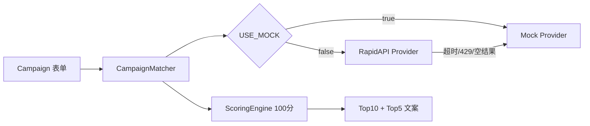

# AI 红人匹配平台

面向海外红人营销的 Campaign 匹配 MVP：商家填写营销需求，系统筛选红人、输出可解释评分、为 Top 5 生成推荐理由与双语邀约信，并展示 Top 10 排名。

同时保留 RAG 文本检索链路，用于基于视频脚本与评论痛点的语义匹配实验。

## 技术栈

| 层级 | 技术 |
|------|------|
| API | FastAPI, Pydantic v2, uvicorn |
| 商业匹配 | Provider 抽象层、Scoring Engine、CampaignMatcher |
| 红人数据 | MockInfluencerProvider / RapidApiInfluencerProvider |
| LLM | 统一 `core/llm_client.py`（DeepSeek / OpenAI / Mock 兜底） |
| RAG | LlamaIndex + BGE 向量检索（可选） |
| 异步 | Celery + Redis + WebSocket 进度 |
| 前端 | 原生 HTML / CSS / JavaScript |
| 测试 | unittest + httpx AsyncClient |

## 架构

```text
前端 Campaign 表单
  |
  +-- 同步 --> POST /api/v1/campaign/match --> CampaignMatcher
  |
  +-- 异步 --> POST /api/v1/campaign/match/async --> Celery --> WebSocket 进度

CampaignMatcher 流程（编排层不感知数据来源）：
  Provider.search() --> ScoringEngine --> Top 10 排序 --> Top 5 文案生成

Provider 层：
  USE_MOCK=true  --> MockInfluencerProvider
  USE_MOCK=false --> RapidApiInfluencerProvider --(失败)--> MockInfluencerProvider

RAG 实验链路（保留）：
  POST /api/v1/demo/match 或 /api/v1/match --> InfluencerRagEngine
```



## 运行模式

| USE_MOCK | 红人数据源 | RAG | 说明 |
|----------|-----------|-----|------|
| `True` | Mock | 关键词 Mock | 本地演示，无需 RapidAPI Key |
| `False` | RapidAPI → Mock 降级 | BGE 向量 | 真实 YouTube 检索，失败自动降级 |

查看当前模式：

```bash
curl http://127.0.0.1:8000/api/v1/runtime
```

## RapidAPI 配置

在 `.env` 中设置：

```env
USE_MOCK=False
RAPID_API_KEY=your_rapidapi_key
RAPID_API_HOST=influencer-data1.p.rapidapi.com
INFLUENCER_PROVIDER=rapidapi
```

接口概要：

- **路径**：`GET /api/v0/analytics/creators/find`
- **参数**：`channelType=youtube`、`keywords=...`
- **Header**：`X-Rapidapi-Key`、`X-Rapidapi-Host`

当前 RapidAPI 仅支持 YouTube；Campaign 需勾选 YouTube 平台。超时、429、异常或空结果将自动降级 Mock，并在响应中返回 `fallback_message`。

## 安装与启动

默认使用 Mock 模式，本地演示不需要 RapidAPI、OpenAI 或 DeepSeek Key。

```bash
python -m venv .venv
.venv\Scripts\activate
pip install -r requirements.txt
copy .env.example .env
```

启动 API：

```bash
uvicorn main:app --reload
```

访问：http://127.0.0.1:8000/

如需启用真实 RapidAPI 或大模型文案生成，只在本地 `.env` 中填写真实 Key，并按需设置：

```env
USE_MOCK=False
LLM_PROVIDER=deepseek
RAPID_API_KEY=your_rapidapi_key_here
DEEPSEEK_API_KEY=your_deepseek_api_key_here
```

异步模式依赖 Redis，需额外启动 Redis 与 Celery Worker：

```bash
celery -A tasks.celery_app.celery_app worker --loglevel=info
```

## 评分体系（100 分）

| 维度 | 分值 | 说明 |
|------|------|------|
| Category Match | 30 | 产品类别 vs 红人内容类别 |
| Keyword Relevance | 25 | 产品描述 vs 频道名/简介关键词 |
| Target Market Match | 20 | 国家/地区匹配 |
| Follower Fit | 15 | 目标粉丝量区间 |
| Content Activity | 10 | totalPosts + totalViews 活跃度 |

Top 10 返回评分排名；**仅 Top 5** 生成完整推荐理由与中英邀约信。真实 API 无互动率/真实性数据，评分与理由均基于可用字段，不伪造。

## Provider 扩展方式

新增商用平台时，只需添加 Provider 文件，**无需修改** CampaignMatcher / ScoringEngine / RecommendationGenerator：

```text
core/providers/
  base.py              # InfluencerProvider 抽象类
  mock_provider.py     # Mock 数据
  rapidapi_provider.py # RapidAPI YouTube
  modash_provider.py   # 待接入
  reserved.py          # HypeAuditor / CreatorIQ / Upfluence 占位
  __init__.py          # get_influencer_provider 工厂
```

步骤：

1. 新建 `xxx_provider.py`，实现 `search(campaign) -> List[Influencer]`
2. 将 API 响应映射为统一 `Influencer` 模型
3. 在 `ProviderName` 与 `get_influencer_provider` 注册
4. 在 `.env.example` 添加配置项

### 后续接入 Modash 方案

1. 创建 `core/providers/modash_provider.py`
2. 调用 Modash Discovery API，映射字段：`id`、`username`、`followers`、`country`、`categories`、`engagement_rate`（若有）
3. 配置 `MODASH_API_KEY`，设置 `INFLUENCER_PROVIDER=modash`
4. CampaignMatcher 调用链保持不变；若 Modash 返回互动率，ScoringEngine 可在未来版本可选启用

## 目录结构

```text
api/                      FastAPI 路由
config/                   环境配置
core/
  campaign_matcher.py       商业匹配编排
  scoring_engine.py         可解释评分
  providers/                红人数据源（Mock + RapidAPI + 预留）
  llm_client.py             统一 LLM 调用
  runtime.py                Mock/真实模式判定
  rag_engine.py             RAG 实验引擎
  schemas.py                数据模型
frontend/                   工作台 UI
tasks/                      Celery 任务
tests/                      单元测试
```

## 测试

默认测试应保持 Mock 模式，不依赖真实外部 API：

```bash
python -m unittest discover -s tests -v
```

真实 RapidAPI 联调需显式开启：

```bash
$env:RUN_LIVE_RAPIDAPI="1"
python -m unittest tests.test_live_rapidapi -v
```

## 安全说明

- 不要提交 `.env` 或真实 API Key
- RapidAPI、OpenAI、DeepSeek 等真实 Key 只放在本地 `.env` 或部署平台的 Secret 中
- `.env.example` 只保留占位符；不要写入 `sk-...` 或真实服务商 Key
- 如果 Key 曾经写入仓库文件或公开渠道，请立即在服务商后台轮换
- 模型缓存、向量库、本地数据库已在 `.gitignore` 中排除
